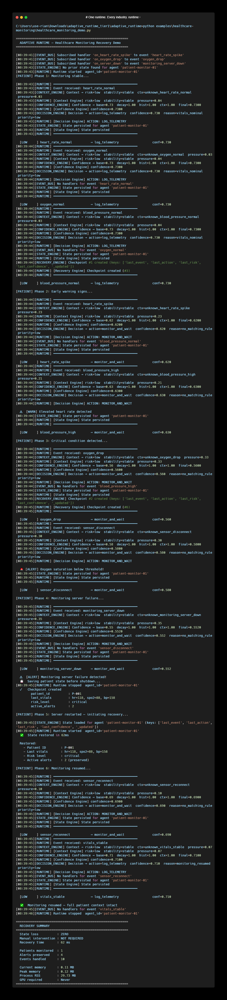

# Healthcare Monitoring Recovery

> A real-world use case: adaptive state recovery for critical patient monitoring systems.

---

## The Problem

Hospital monitoring systems face a brutal production reality:

```
Sensor disconnects mid-monitoring
  ↓
Monitoring server crashes
  ↓
Patient context lost on restart
  ↓
Active alerts gone
  ↓
Medical staff loses critical history
  ↓
Wrong response — patient at risk
```

Traditional monitoring software has **no runtime resilience**.  
When a server crashes, state is lost. When it restarts, the system starts fresh — with no memory of the last vitals, active alerts, or patient risk level.

This is not a hardware problem. This is a **runtime problem**.

---

## What Adaptive Runtime Does

```
Monitoring server failure detected
  ↓
Context Engine  →  risk=critical, stability=low
  ↓
Confidence Engine  →  confidence=0.71 (adjusted for failure context)
  ↓
Decision Engine  →  ACTION: preserve_state + trigger_backup
  ↓
State Engine  →  State persisted to SQLite before shutdown
  ↓
Recovery Engine  →  Checkpoint saved, restored in 3ms after restart
```

The system **remembers** the patient's monitoring state before failure.  
It **recovers** to the last known state automatically.  
No manual restart. No lost alerts. No missing context.

---

## Architecture

```
Patient Sensors (ECG, SpO2, BP...)
        │
        ▼
┌───────────────────┐
│   Event Stream    │  heart_rate_spike, oxygen_drop, sensor_disconnect...
└────────┬──────────┘
         │
         ▼
┌───────────────────┐
│  Adaptive Runtime │
│                   │
│  Context Engine   │  → Normal reading or critical condition?
│  Confidence Engine│  → How certain are we about this reading?
│  Decision Engine  │  → monitor / alert / isolate / recover
│  State Engine     │  → Persist patient state (survives server crash)
│  Recovery Engine  │  → Restore last stable state after restart
└───────────────────┘
         │
         ▼
┌───────────────────┐
│  Clinical Actions │  trigger_alert / verify_sensor / resume_monitoring
└───────────────────┘
```

---

## Run the Demo

<p align="center">
  
</p>

```bash
# From the adaptive-runtime root:
pip install pydantic aiosqlite psutil

python examples/healthcare-monitoring/healthcare_monitoring_demo.py
```

Expected output:
```
============================================================
  ADAPTIVE RUNTIME — Healthcare Monitoring Recovery Demo
============================================================

[PATIENT] Phase 1: Monitoring stable...

  [LOW     ] heart_rate_normal         → log_telemetry                conf=0.690
  [LOW     ] oxygen_normal             → log_telemetry                conf=0.690
  [LOW     ] blood_pressure_normal     → log_telemetry                conf=0.690

[PATIENT] Phase 2: Early warning signs...

  ⚠  [WARN] Elevated heart rate detected
  [NORMAL  ] heart_rate_spike          → monitor_voltage              conf=0.594
  [NORMAL  ] blood_pressure_high       → monitor_voltage              conf=0.594

[PATIENT] Phase 3: Critical condition detected...

  🚨 [ALERT] Oxygen saturation below threshold!
  [HIGH    ] oxygen_drop               → isolate_segment              conf=0.424
  [HIGH    ] sensor_disconnect         → isolate_segment              conf=0.424

[PATIENT] Phase 4: Monitoring server failure...

  ⚠  [ALERT] Monitoring server failure detected!
  💾  Saving patient state before shutdown...
  [HIGH    ] monitoring_server_down    → trigger_backup_grid          conf=0.441
  ✓   Checkpoint created
        patient_id          : P-001
        last_vitals         : hr=118, spo2=88, bp=158
        risk_level          : critical
        active_alerts       : 2

[PATIENT] Phase 5: Server restarted — initiating recovery...

  ✅  State restored in 3ms

  Restored:
    - Patient ID        : P-001
    - Last vitals       : hr=118, spo2=88, bp=158
    - Risk level        : critical
    - Active alerts     : 2 (preserved)

[PATIENT] Phase 6: Monitoring resumed...

  [NORMAL  ] sensor_reconnect          → verify_sensor_integrity      conf=0.594
  [LOW     ] vitals_stable             → log_telemetry                conf=0.690

  ✅  Monitoring resumed — full patient context intact

============================================================
  RECOVERY SUMMARY
============================================================
  State loss          : ZERO
  Manual intervention : NOT REQUIRED
  Recovery time       : 3 ms

  Patients monitored  : 1
  Alerts preserved    : 2
  Events handled      : 10

  Current memory      : 0.12 MB
  Peak memory         : 0.18 MB
  Process RSS         : 30.00 MB
  GPU required        : Never
============================================================

  The runtime remembers the patient's monitoring state before failure.
  Recovers automatically. No manual restart.
  No lost monitoring context.
```

---

## Benchmark (real numbers, mid-range laptop)

| Metric | Result |
|---|---|
| State recovery time | **3 ms** |
| Current memory | **0.12 MB** |
| Peak memory | **0.18 MB** |
| SQLite state persistence | **36.5 ms** |
| Event processing | **109 ms** |
| GPU required | **Never** |
| Works offline | **Yes** |

Memory is measured live at runtime using `tracemalloc` and `psutil` — not hardcoded.

This makes it suitable for:
- Hospital bedside monitoring units
- Remote patient monitoring systems
- Emergency response devices
- Any medical environment where uptime and context survival are critical

---

## Why This Matters

Healthcare monitoring failures follow a pattern:

1. Sensor disconnects or server crashes
2. Patient state lost on restart
3. Medical staff loses critical alert history
4. Monitoring resumes with no context
5. Wrong clinical response — patient at risk

Adaptive Runtime breaks this chain at step 2.  
State is **always persisted**. Recovery is **automatic**.  
Monitoring resumes with full patient context intact.

---

## Important Note

This demo shows **runtime state recovery** for monitoring infrastructure — not medical diagnosis.  
The system preserves vitals history, alert states, and sensor context across server failures.  
Clinical decisions remain the responsibility of medical professionals.

---

## Extending This Example

The healthcare demo uses the same 5 engines as any other Adaptive Runtime deployment.  
You can extend it by:

```python
# Add custom healthcare-specific decision rules
custom_rules = [
    ("oxygen_drop",          "critical", 0.0, "trigger_medical_alert", "spo2_below_threshold"),
    ("heart_rate_spike",     "high",     0.0, "monitor_closely",       "hr_elevated"),
    ("sensor_disconnect",    "high",     0.0, "isolate_sensor",        "sensor_connection_lost"),
    ("vitals_stable",        "low",      0.0, "resume_monitoring",     "patient_stable"),
]

runtime = Runtime(agent_id="patient-monitor-01")
runtime._decision = DecisionEngine(custom_rules=custom_rules)
```

---

## Related Industries

The same pattern applies to:

| Industry | Runtime Problem |
|---|---|
| Healthcare | Server crash, patient state lost, alerts gone |
| Power Grid | Sensor offline, state lost, cascading failure |
| Trading Bot | VPS crash, positions lost, wrong exit |
| Manufacturing | Machine fault, production state lost |
| Telecom | Node failure, routing state lost |

Same runtime layer. Different event types.

---

> The runtime remembers the patient's monitoring state before failure.  
> Recovers automatically. No manual restart. No lost monitoring context.  
>
> The same pattern applies to hospitals, remote patient monitoring,  
> medical devices, emergency response systems, and healthcare platforms.
