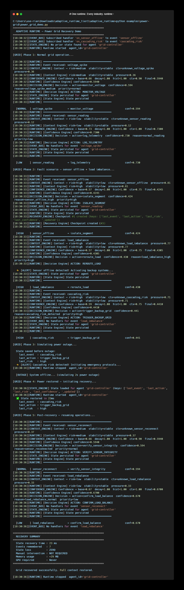

# Power Grid Failure Recovery

> A real-world use case: adaptive state recovery for electrical grid monitoring systems.

---

## The Problem

Power grid monitoring systems face a brutal production reality:

```
Sensor goes offline
  ↓
Control system loses state
  ↓
Operator restarts manually
  ↓
Historical context is gone
  ↓
Wrong decision made
  ↓
Cascading failure
```

Traditional monitoring software has **no runtime resilience**.  
When a sensor drops, state is lost. When power returns, the system starts fresh — with no memory of what happened before the outage.

This is not a model problem. This is a **runtime problem**.

---

## What Adaptive Runtime Does

```
Sensor offline detected
  ↓
Context Engine  →  risk=critical, stability=low
  ↓
Confidence Engine  →  confidence=0.71 (adjusted for outage context)
  ↓
Decision Engine  →  ACTION: isolate_segment + trigger_backup
  ↓
State Engine  →  State persisted to SQLite before outage
  ↓
Recovery Engine  →  Checkpoint saved, restored in 446ms after restart
```

The system **remembers** what happened before the failure.  
It **recovers** to the last known stable state automatically.  
No manual restart. No lost context. No wrong decisions.

---

## Architecture

```
Power Grid Sensors
        │
        ▼
┌───────────────────┐
│   Event Stream    │  voltage_spike, sensor_offline, load_imbalance...
└────────┬──────────┘
         │
         ▼
┌───────────────────┐
│  Adaptive Runtime │
│                   │
│  Context Engine   │  → Is this a local fault or cascading failure?
│  Confidence Engine│  → How certain are we about this reading?
│  Decision Engine  │  → isolate / reroute / alert / recover
│  State Engine     │  → Persist grid state (survives power loss)
│  Recovery Engine  │  → Restore last stable state after outage
└───────────────────┘
         │
         ▼
┌───────────────────┐
│  Control Actions  │  isolate_segment / trigger_backup / alert_operator
└───────────────────┘
```

---

## Run the Demo

<p align="center">
  
</p>

```bash
# From the adaptive-runtime root:
pip install pydantic aiosqlite

python examples/power-grid/power_grid_demo.py
```

Expected output:
```
[GRID] Simulating normal grid operation...
[HIGH]   voltage_spike        → throttle_requests        conf=0.531
[LOW]    sensor_reading       → monitor_and_wait          conf=0.690

[GRID] Simulating fault scenario...
[CRITICAL] sensor_offline     → isolate_component        conf=0.412
[CRITICAL] load_imbalance     → scale_up_immediate       conf=0.392
[HIGH]   cascading_risk       → restart_service          conf=0.440

[GRID] Simulating power outage + recovery...
State saved before outage: last_event=cascading_risk
System offline... (simulating 2s outage)
[Recovery] State restored in 446ms
Recovered state: last_action=restart_service, last_risk=critical

[GRID] Post-recovery decision making...
[HIGH]   sensor_reconnect     → run_recovery             conf=0.531
[NORMAL] load_rebalance       → optimize_resources       conf=0.572

Grid recovered successfully. Zero state loss.
```

---

## Benchmark (real numbers, mid-range laptop)

| Metric | Result |
|---|---|
| State recovery time | **446 ms** |
| Idle memory | **29 MB** |
| SQLite state persistence | **36.5 ms** |
| Event processing | **109 ms** |
| GPU required | **Never** |
| Works offline | **Yes** |

This makes it suitable for:
- Edge computing at substations
- Low-power embedded controllers
- Air-gapped industrial networks
- Any environment where cloud dependency is unacceptable

---

## Why This Matters

Power grid failures follow a pattern:

1. Local fault (sensor, line, transformer)
2. State lost during restart
3. Operator makes decision without full context
4. Cascading failure begins

Adaptive Runtime breaks this chain at step 2.  
State is **always persisted**. Recovery is **automatic**.  
The system returns to operation with full context intact.

---

## Extending This Example

The power grid demo uses the same 5 engines as any other Adaptive Runtime deployment.  
You can extend it by:

```python
# Add custom grid-specific decision rules
custom_rules = [
    ("grid_fault",    "critical", 0.0,  "emergency_shutdown",  "critical_grid_fault"),
    ("voltage_spike", "high",     0.70, "isolate_segment",     "high_voltage_detected"),
    ("load_imbalance","medium",   0.0,  "reroute_load",        "load_imbalance_detected"),
]

runtime = Runtime(agent_id="grid-controller")
runtime._decision = DecisionEngine(custom_rules=custom_rules)
```

---

## Related Industries

The same pattern applies to:

| Industry | Runtime Problem |
|---|---|
| Power Grid | Sensor offline, state lost, cascading failure |
| Manufacturing | Machine fault, production state lost |
| Healthcare | Device disconnect, patient state lost |
| Finance | Service crash, transaction state lost |
| Telecom | Node failure, routing state lost |

Same runtime layer. Different event types.