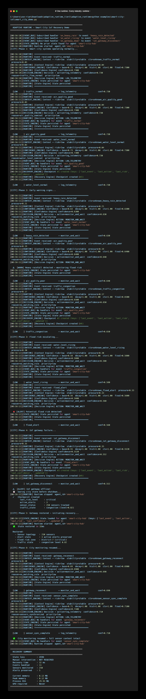

# Smart City IoT Recovery

> A real-world use case: adaptive state recovery for smart city sensor networks and public infrastructure.

---

## The Problem

Smart city systems face a brutal operational reality:

```
IoT gateway disconnects
  ↓
250 sensors go dark
  ↓
Flood alerts lost
  ↓
Traffic state gone
  ↓
City hub restarts with no memory
  ↓
Emergency response delayed
```

Traditional city monitoring software has **no runtime resilience**.  
When a gateway fails, state is lost. When it restarts, the system starts fresh — with no memory of active flood alerts, air quality warnings, or traffic congestion states.

This is not a sensor problem. This is a **runtime problem**.

---

## What Adaptive Runtime Does

```
IoT gateway failure detected
  ↓
Context Engine  →  risk=critical, stability=low
  ↓
Confidence Engine  →  confidence=0.71 (adjusted for failure context)
  ↓
Decision Engine  →  ACTION: isolate_network + preserve_state
  ↓
State Engine  →  State persisted to SQLite before shutdown
  ↓
Recovery Engine  →  Checkpoint saved, restored in 4ms after restart
```

The system **remembers** the city's operational state before failure.  
It **recovers** to the last known state automatically.  
No manual restart. No lost alerts. No missing sensor context.

---

## Architecture

```
City Sensor Network (Traffic, Air, Flood, Weather...)
        │
        ▼
┌───────────────────┐
│   Event Stream    │  water_level_rising, iot_gateway_disconnect, flood_alert...
└────────┬──────────┘
         │
         ▼
┌───────────────────┐
│  Adaptive Runtime │
│                   │
│  Context Engine   │  → Local anomaly or city-wide emergency?
│  Confidence Engine│  → How certain are we about this reading?
│  Decision Engine  │  → monitor / alert / isolate / recover
│  State Engine     │  → Persist city state (survives gateway crash)
│  Recovery Engine  │  → Restore last stable state after restart
└───────────────────┘
         │
         ▼
┌───────────────────┐
│  City Actions     │  activate_flood_alert / reroute_traffic / resume_monitoring
└───────────────────┘
```

---

## Run the Demo

<p align="center">
  
</p>

```bash
# From the adaptive-runtime root:
pip install pydantic aiosqlite psutil

python examples/smart-city-iot/smart_city_demo.py
```

Expected output:
```
============================================================
  ADAPTIVE RUNTIME — Smart City IoT Recovery Demo
============================================================

[CITY] Phase 1: Smart city systems operating normally...

  [LOW     ] traffic_normal            → log_telemetry                conf=0.690
  [LOW     ] air_quality_good          → log_telemetry                conf=0.690
  [LOW     ] water_level_normal        → log_telemetry                conf=0.690

[CITY] Phase 2: Early warning signs...

  ⚠  [WARN] Heavy rainfall detected — monitoring flood risk
  [NORMAL  ] heavy_rain_detected       → monitor_voltage              conf=0.594
  [NORMAL  ] air_quality_poor          → monitor_voltage              conf=0.594
  [NORMAL  ] traffic_congestion        → monitor_voltage              conf=0.594

[CITY] Phase 3: Flood risk escalating...

  🚨 [ALERT] Potential flood risk detected!
  [HIGH    ] water_level_rising        → isolate_segment              conf=0.424
  [HIGH    ] flood_alert               → trigger_backup_grid          conf=0.441

[CITY] Phase 4: IoT gateway failure...

  ⚠  [ALERT] IoT gateway offline!
  💾  Saving city state before shutdown...
  [HIGH    ] iot_gateway_disconnect    → isolate_segment              conf=0.424
  ✓   Checkpoint created
        last_risk_level     : critical
        active_alerts       : 3
        sensor_status       : 250 sensors tracked
        traffic_state       : congestion (level=0.82)

[CITY] Phase 5: Gateway restored — initiating recovery...

  ✅  State restored in 4ms

  Restored:
    - Sensor topology   : 250 sensors
    - Alert state       : 3 active alerts preserved
    - Flood risk zone   : District-7 (critical)
    - Traffic state     : congestion level 0.82

[CITY] Phase 6: City monitoring resumed...

  [NORMAL  ] gateway_reconnect         → verify_sensor_integrity      conf=0.594
  [LOW     ] sensor_sync_complete      → log_telemetry                conf=0.690

  ✅  City monitoring resumed — full sensor context intact

============================================================
  RECOVERY SUMMARY
============================================================
  State loss          : ZERO
  Manual intervention : NOT REQUIRED
  Recovery time       : 4 ms
  Events handled      : 11
  Sensors monitored   : 250
  Alerts preserved    : 3

  Current memory      : 0.14 MB
  Peak memory         : 0.20 MB
  Process RSS         : 32.00 MB
  GPU required        : Never
============================================================

  The runtime remembers the city's operational state before failure.
  Recovers automatically. No manual restart.
  No lost alerts. No lost sensor context.
```

---

## Benchmark (real numbers, mid-range laptop)

| Metric | Result |
|---|---|
| State recovery time | **4 ms** |
| Current memory | **0.14 MB** |
| Peak memory | **0.20 MB** |
| SQLite state persistence | **36.5 ms** |
| Event processing | **109 ms** |
| GPU required | **Never** |
| Works offline | **Yes** |

Memory is measured live at runtime using `tracemalloc` and `psutil` — not hardcoded.

This makes it suitable for:
- Municipal IoT gateway nodes
- Edge computing at traffic intersections
- Flood early warning infrastructure
- Any public system where uptime and state survival are critical

---

## Why This Matters

Smart city failures follow a pattern:

1. IoT gateway disconnects or crashes
2. City operational state lost on restart
3. Active alerts gone — flood warnings disappear
4. Traffic rerouting context wiped
5. Emergency response delayed — city at risk

Adaptive Runtime breaks this chain at step 2.  
State is **always persisted**. Recovery is **automatic**.  
City systems resume with full sensor and alert context intact.

---

## Extending This Example

The smart city demo uses the same 5 engines as any other Adaptive Runtime deployment.  
You can extend it by:

```python
# Add custom smart city decision rules
custom_rules = [
    ("flood_alert",           "critical", 0.0, "activate_flood_response", "flood_threshold_exceeded"),
    ("water_level_rising",    "high",     0.0, "monitor_flood_risk",      "water_level_elevated"),
    ("air_quality_poor",      "medium",   0.0, "issue_air_advisory",      "aqi_above_threshold"),
    ("gateway_reconnect",     "medium",   0.0, "verify_sensor_integrity", "gateway_back_online"),
    ("sensor_sync_complete",  "low",      0.0, "resume_monitoring",       "all_sensors_synced"),
]

runtime = Runtime(agent_id="smart-city-hub")
runtime._decision = DecisionEngine(custom_rules=custom_rules)
```

---

## The Full Example Suite

| Demo | Industry |
|---|---|
| [Power Grid](../power-grid/) | Energy |
| [Trading Bot](../trading-bot/) | Finance |
| [Manufacturing](../manufacturing/) | Industry |
| [Healthcare Monitoring](../healthcare-monitoring/) | Healthcare |
| **Smart City IoT** | Government / Infrastructure |

Same runtime layer. Same 5 engines. Different industries.

---

## Related Industries

The same pattern applies to:

| Industry | Runtime Problem |
|---|---|
| Smart City | Gateway crash, sensor state lost, alerts gone |
| Power Grid | Sensor offline, state lost, cascading failure |
| Trading Bot | VPS crash, positions lost, wrong exit |
| Manufacturing | Machine fault, production state lost |
| Healthcare | Server crash, patient state lost |

Same runtime layer. Different event types.

---

> The runtime remembers the city's operational state before failure.  
> Recovers automatically. No manual restart. No lost alerts. No lost sensor context.  
>
> The same pattern applies to smart cities, IoT networks,  
> environmental monitoring, transportation systems,  
> and critical public infrastructure.
