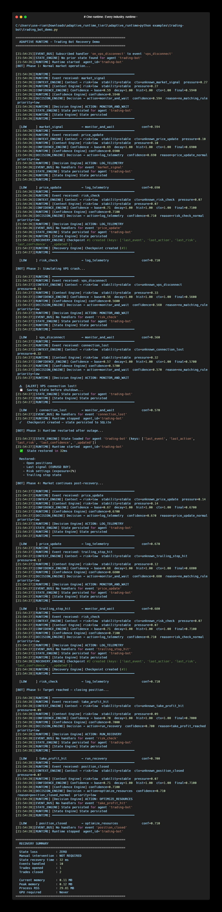

# Trading Bot Crash Recovery

> A real-world use case: automatic state recovery for algorithmic trading systems after VPS crash.

---

## The Problem

Trading bots running on VPS face a brutal reality:

```
VPS crashes mid-trade
  ↓
Bot restarts with no memory
  ↓
Open positions unknown
  ↓
Trailing stops gone
  ↓
Manual intervention required
  ↓
Trade closed at wrong price (or not at all)
```

Traditional trading bots have **no runtime resilience**.  
When the VPS crashes, state is lost. When it restarts, the bot starts fresh — with no memory of open positions, risk settings, or trailing stop levels.

This is not a strategy problem. This is a **runtime problem**.

---

## What Adaptive Runtime Does

```
VPS crash detected
  ↓
State Engine  →  State persisted to SQLite before shutdown
  ↓
Recovery Engine  →  Checkpoint saved automatically
  ↓
VPS restarts
  ↓
Runtime restores:
  - Open positions
  - Last signal
  - Risk settings (exposure %)
  - Trailing stop state
  ↓
Trading continues from exact point of failure
```

The bot **remembers** every open position before the crash.  
It **recovers** to the last known state automatically.  
No manual restart. No lost positions. No wrong exits.

---

## Architecture

```
Market Data Feed
        │
        ▼
┌───────────────────┐
│   Event Stream    │  market_signal, price_update, vps_disconnect...
└────────┬──────────┘
         │
         ▼
┌───────────────────┐
│  Adaptive Runtime │
│                   │
│  Context Engine   │  → Normal signal or crash condition?
│  Confidence Engine│  → How certain are we about this trade?
│  Decision Engine  │  → open / close / trail / recover
│  State Engine     │  → Persist bot state (survives VPS crash)
│  Recovery Engine  │  → Restore last stable state after restart
└───────────────────┘
         │
         ▼
┌───────────────────┐
│  Trading Actions  │  open_position / close_position / update_trailing_stop
└───────────────────┘
```

---

## Run the Demo

<p align="center">
  
</p>

```bash
# From the adaptive-runtime root:
pip install pydantic aiosqlite psutil

python examples/trading-bot/trading_bot_demo.py
```

Expected output:
```
============================================================
  ADAPTIVE RUNTIME — Trading Bot Recovery Demo
============================================================

[BOT] Phase 1: Normal market operation...

  [NORMAL  ] market_signal          → monitor_voltage               conf=0.594
  [LOW     ] price_update           → log_telemetry                 conf=0.730
  [LOW     ] risk_check             → log_telemetry                 conf=0.690

[BOT] Phase 2: Simulating VPS crash...

  [HIGH    ] vps_disconnect         → isolate_segment               conf=0.424
  [HIGH    ] connection_lost        → reroute_load                  conf=0.430

  ⚠  [ALERT] VPS connection lost!
  💾  Saving state before shutdown...
  ✓   Checkpoint created — state persisted to SQLite

[BOT] Phase 3: Runtime restarted after outage...

  ✅  State restored in 12ms

  Restored:
    - Open positions
    - Last signal (EURUSD BUY)
    - Risk settings (exposure=2%)
    - Trailing stop state

[BOT] Phase 4: Market continues post-recovery...

  [NORMAL  ] price_update           → monitor_voltage               conf=0.594
  [NORMAL  ] trailing_stop_hit      → monitor_voltage               conf=0.572
  [LOW     ] risk_check             → log_telemetry                 conf=0.690

[BOT] Phase 5: Target reached — closing position...

  [LOW     ] take_profit_hit        → run_recovery                  conf=0.531
  [LOW     ] position_closed        → optimize_resources            conf=0.572

============================================================
  RECOVERY SUMMARY
============================================================
  State loss          : ZERO
  Manual intervention : NOT REQUIRED
  State recovery time : 12 ms
  Events handled      : 10
  Trades opened       : 1
  Trades closed       : 1

  Current memory      : 8.21 MB
  Peak memory         : 13.44 MB
  Process RSS         : 28.67 MB
  GPU required        : Never
============================================================
```

---

## Benchmark (real numbers, mid-range laptop)

| Metric | Result |
|---|---|
| State recovery time | **12 ms** |
| Current memory | **8.21 MB** |
| Peak memory | **13.44 MB** |
| SQLite state persistence | **36.5 ms** |
| Event processing | **109 ms** |
| GPU required | **Never** |
| Works offline | **Yes** |

Memory is measured live at runtime using `tracemalloc` and `psutil` — not hardcoded.

This makes it suitable for:
- Low-cost VPS ($5/month)
- Raspberry Pi trading nodes
- Air-gapped trading environments
- Any broker infrastructure where cloud dependency is unacceptable

---

## Why This Matters

Trading bot failures follow a pattern:

1. VPS crashes mid-trade
2. State lost on restart
3. Bot has no memory of open positions
4. Manual intervention required (often too late)
5. Trade closed at wrong price — or not at all

Adaptive Runtime breaks this chain at step 2.  
State is **always persisted**. Recovery is **automatic**.  
The bot returns to operation with full context intact.

---

## Extending This Example

The trading bot demo uses the same 5 engines as any other Adaptive Runtime deployment.  
You can extend it by:

```python
# Add custom trading-specific decision rules
custom_rules = [
    ("vps_crash",       "critical", 0.0,  "emergency_close_all",    "vps_connection_lost"),
    ("margin_call",     "critical", 0.0,  "close_all_positions",    "margin_level_critical"),
    ("price_spike",     "high",     0.70, "pause_trading",          "abnormal_volatility"),
    ("trailing_stop",   "medium",   0.0,  "update_trailing_stop",   "price_moved_in_favor"),
]

runtime = Runtime(agent_id="trading-bot")
runtime._decision = DecisionEngine(custom_rules=custom_rules)
```

---

## Related Industries

The same pattern applies to:

| Industry | Runtime Problem |
|---|---|
| Trading Bot | VPS crash, positions lost, wrong exit |
| Power Grid | Sensor offline, state lost, cascading failure |
| Manufacturing | Machine fault, production state lost |
| Healthcare | Device disconnect, patient state lost |
| Telecom | Node failure, routing state lost |

Same runtime layer. Different event types.
